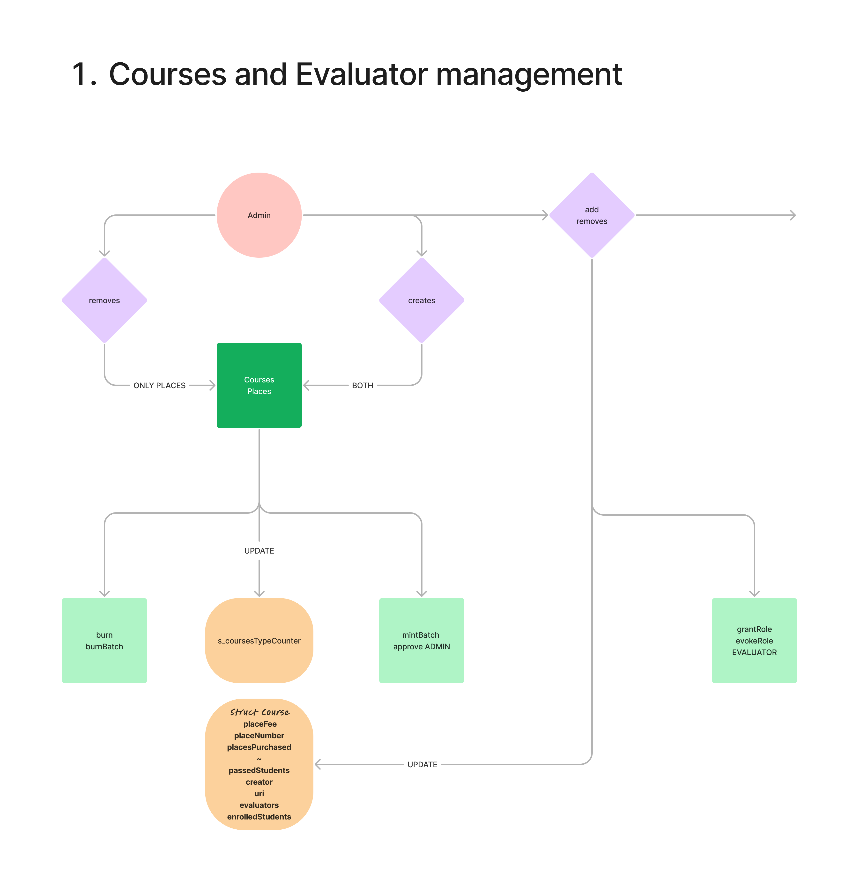
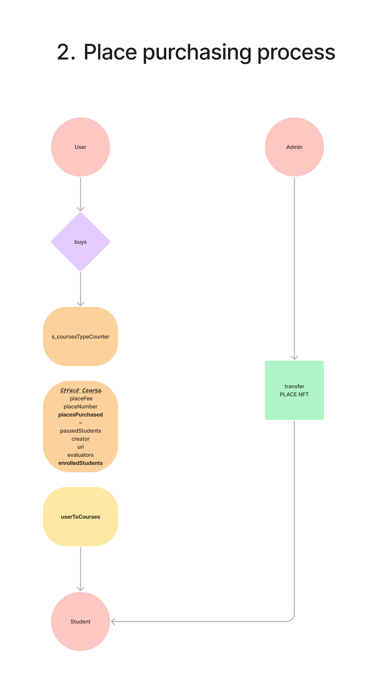
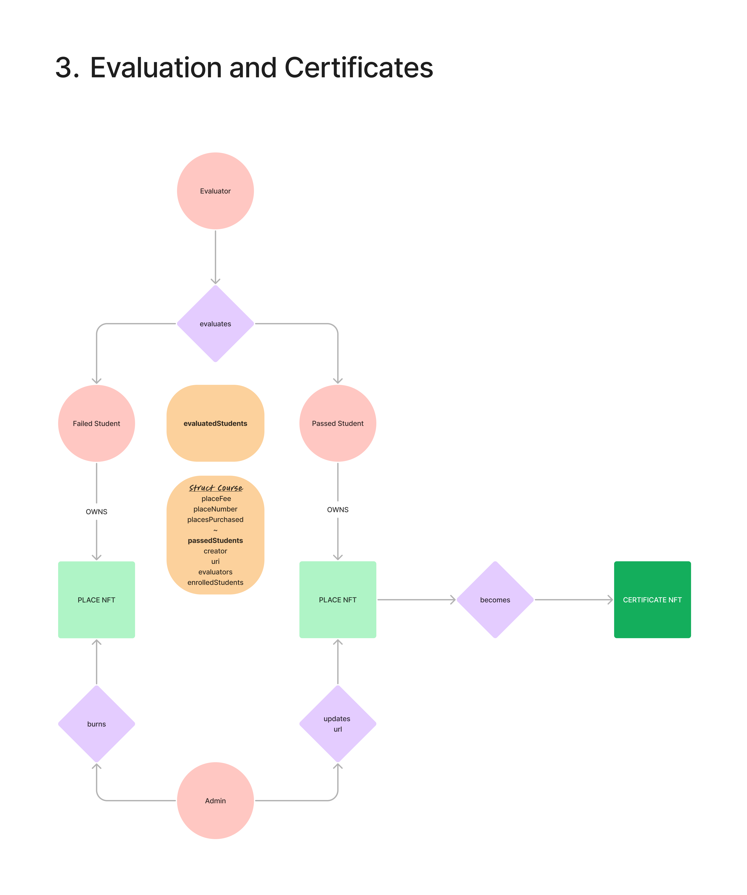

## Dynamic 1155 NFT - Course Course Generator

Each User can buy a Course NFT token, which will enable him to become a Learning Student.
An exam will take place in real life by one Evaluator in a specific date.
After that specific date, each Course NFT token can either

1. become a Course and it can be transferred to the Student's account only if he's been given a mark greater than 6 out of 10
2. it will be burned if the Student has not passed the exam

## Foundry

ERC1155
Opensea

### Prerequisites

- .env file with 5 metamask accounts private keys (see env. example)
- ADMIN account must have more than 0.5 eth, others more than 0.02 eth
- forge installed

### Deploy interactions to testnet

**make**

1. deploy
2. createCourses
3. setUpEvaluator
4. buyPlaces
5. transferNFT
6. evaluate
7. makeCourses
